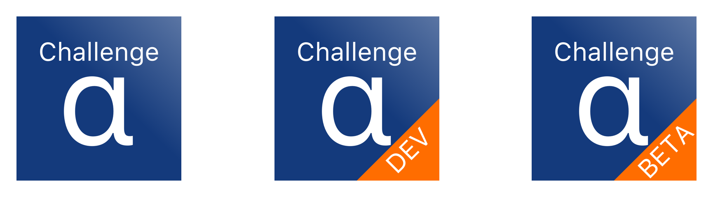

# Desafio Alpha

**Por:** [Theo Mendes](https://github.com/theomendes) < theodefranca@gmail.com >.

## 1. Contúdo

- [1. Contúdo](#1-contúdo)
- [2. O Projeto](#2-o-projeto)
- [3. Significado dos logs](#3-significado-dos-logs)
- [4. Instalação](#4-instalação)
    - [4.1. Prepare o ambiente](#41-prepare-o-ambiente)
    - [4.2. Configuração do projeto](#42-configuração-do-projeto)
- [5. Design](#5-design)
    - [5.1. Feed](#51-feed)
- [6. Toque a mais](#6-toque-a-mais)
    - [6.1. Configurei o projeto de maneira segura para diversos ambientes, Dev, AdHoc e AppStore.](#61-configurei-o-projeto-de-maneira-segura-para-diversos-ambientes-dev-adhoc-e-appstore)
    - [6.2. Exibo além do preço atual, o desconto atual do local.](#62-exibo-além-do-preço-atual-o-desconto-atual-do-local)
    - [6.3. Dentro das seções são ordanadas pela porcentagem do desconto](#63-dentro-das-seções-são-ordanadas-pela-porcentagem-do-desconto)
    - [6.4. Uso células diferenciadas para o Hotel e Pacotes](#64-uso-células-diferenciadas-para-o-hotel-e-pacotes)
    - [6.5 Feed centrado na experiência do usuário](#65-feed-centrado-na-experiência-do-usuário)
    - [6.6 Auto Layout, a célula de pacote se adapita a largura do celular, mantendo aspect ratio.](#66-auto-layout-a-célula-de-pacote-se-adapita-a-largura-do-celular-mantendo-aspect-ratio)
    - [6.7 Localização do app tanto em Inglês quanto Português.](#67-localização-do-app-tanto-em-inglês-quanto-português)
- [7. Testes](#7-testes)
    - [7.1. Unitários](#71-unitários)
    - [7.2. UI](#72-ui)
- [8. Dependências](#8-dependências)
    - [8.1 Bundler](#81-bundler)
    - [8.2. CocoaPods](#82-cocoapods)
        - [8.2.1. SwiftLint](#821-swiftlint)
        - [8.2.2. SwiftGen](#822-swiftgen)
    - [8.3. Carthage](#83-carthage)
        - [8.3.1. RxSwift](#831-rxswift)
        - [8.3.2. RxDataSources](#832-rxdatasources)
        - [8.3.3. Moya](#833-moya)
        - [8.3.4. SnapKit](#834-snapkit)
        - [8.3.5. Kingfisher](#835-kingfisher)
- [9. Vulnerabilidades](#9-vulnerabilidades)
    - [9.1. Moya - Beta](#91-moya---beta)
    - [9.2. Imagens das celulas de collection view - HTTPS](#92-imagens-das-celulas-de-collection-view---https)

## 2. O Projeto
Arquitetura: **MVVM-C**

A escolha resta arquitetura deve-se ao fato de ser bastante testavel mas ainda ter um nivel de simplicidade que pode ser rápidamente estruturado. Implementei um Coordinator pois isso é uma das coisas que falta no MVVM uma camada de routing.

O projeto é separado em 3 Schemas: **Debug, AdHoc e AppStore** e 3 Build Configurations: **Development, Production, Stage**, tem uma bundle id, nome e icones diferentes para cada Build Configuration, para assim em um único aparelho poder se instaladas cada versão, o nome e icone são para mera diferenciação visual.

O projeto para evitar erro humano automaticamente detecta para qual schema esta buildando e pega as variaveis de ambientes de acordo, por exemplo você pode querer durante o desenvolvimento usar o localhost como url para consumir uma API, e uma url real para o app em produção. Para assim evitar que haja chance de acabar indo uma url de desenvolvimento para produção.

Usei tanto o CocoaPods, como Carthage. Fiz essa escolha pois como o Carthage compila os frameworks quando você pega eles, isso faz diminuir consideravelmente o tempo de compilação do projeto todo, assim aumentando a produtividade. Usei o CocoaPods somente pelo fato que nem tudo esta no Carthage, principalmente dois grandes frameworks muito usados: SwiftLint e SwiftGen.

## 3. Significado dos logs
* 👶 -> View Init
* ⚰️ -> View Deinit
* 🧠 -> View Model
* 🧭 -> Coordinator
* 🎮 -> View Controller
* 🔲 -> Table View Cell
* 🏻 -> Collection View Cell
* 📶 -> Network
    * ⬇️ -> Receiving
    * ⬆️ -> Sending
    * ✅ -> Status Successful
    * ⚠️ -> Status Failure


## 4. Instalação

### 4.1. Prepare o ambiente
Para rodar este projeto você irá precisar do Ruby [Bundler](http://bundler.io), [Carthage](https://github.com/Carthage/Carthage) e [CocoaPods](https://cocoapods.org/)

Carthage pode ser instalado rodando o seguinte comando:

```bash
brew update
brew install carthage
```

O Bundle deve ter vindo junto com a instalação do Ruby. Você precisa do Ruby maior que 2.4. Se você não tem o bundle, pode ser instalado rodando o seguinte comando:

```bash
sudo gem install bundler
```

### 4.2. Configuração do projeto
1. Na pasta Root do projeto rode
```bash
bundle install
```
2. Rode a instalação do CocoaPods
```bash
bundle exec pod install
```
3. Rode o Carthage
```bash
carthage bootstrap --platform ios --cache-builds --no-use-binaries
```
## 5. Design

### 5.1. Feed
Como o desafio não impunha um design especifico do feed, preparei algumas telas. Não quis seguir com o exemplo de tabulação dado no README do desafio pelo de ter ja de cara um problema de UX, o usuário para ir até a informação que precisa precisa escrolar muito, como por exemplo, se ele quiser procurar um hotel 3 estrelas, na tabulação de exemplo ele teria que percorrer um grande caminho e poderia até desistir da compra.

Analizando o app de vocês para iOS e o site, para mim ficou claro que vocês valorizam dar destaque para o local e o preço atrativo. Seguindo esta ideia resolvi aplicar um feed com sessões laterais, dentro das sessões laterais eu ordenei decrescente pela porcentagem de desconto, logo os hoteis que acabaram de ter desconto ficam por ultimo.

Percebi que a Hurb da bastante valor para os pacotes, levando em conta isso resolvi colocar os pacotes como a primeira coisa do feed e dando bastante destaque para foto.

Preparei também 2 telas extras, uma de carregando e outra de quando deu erro, por questão de escopo não preparei metodos para se recuperar do erro.

<p align="center">
    
</p>

<p align="center">
    
</p>

## 6. Toque a mais
Ao invés de implementar telas extras resolvi somente focar no desenvolvimento do feed, para assim criar um feed bem conceituado e um projeto bem configurado

### 6.1. Configurei o projeto de maneira segura para diversos ambientes, Dev, AdHoc e AppStore.
Isso mantem a consistencia do projeto entre os colaboradores, não precisando ficar mudando strings de API antes de dar um push, por exemplo, ou até mesmo ao mandar para a AppStore.

### 6.2. Exibo além do preço atual, o desconto atual do local.
Pela análise tanto do app como site vi que uma coisa que vocês valorizam é o preço atrativo, então adicionar essa lógica me pareceu interessante.

### 6.3. Dentro das seções são ordanadas pela porcentagem do desconto
Com isso eu crio um destaque para os maiores descontos, e consequentemente o item que o desconto acabou de finalizar tem menos prioridade no feed.

### 6.4. Uso células diferenciadas para o Hotel e Pacotes
A Hurb valoriza os seus pacotes, então colocando eles na primeira parte do feed, e com elementos diferenciados do hotel, crio um destaque para eles.

### 6.5 Feed centrado na experiência do usuário
O usuário acha rapidamente a informação que ele quer, como o Preço, facilidades, local e estrelas.

### 6.6 Auto Layout, a célula de pacote se adapita a largura do celular, mantendo aspect ratio.
A celula fica proporcional para qualquer dispositivo, e as de hotel sempre ficam no centro da tela.

### 6.7 Localização do app tanto em Inglês quanto Português.
Como a Hurb esta em um processo de internacionalização, é uma obrigação do app se adaptar aos locais que ele vai está disponível. Isso incluindo o preço, como por exempo em **en_US** 3,000.00 em **pt_BR** 3.000,00. Mas tomei cuidado com o fato da API retornar a currency que o preço esta, então independente do caso vai sempre aparecer o simbulo como R$.

## 7. Testes
Total de cobertura:  **86%**

### 7.1. Unitários
Criei testes unitários para o ViewModel e o Network layer, usei um stub em formato json para mockar a resposta da API, para assim garantir a consistencia dos dados. o stup criei de uma resposta da API da hurb, mas deletei alguns objetos para garantir a diferença entre a API real para o stub

### 7.2. UI
Pelo fato do app conter uma tela eu testei o scroll vertical, e swipe em duas sessões.

## 8. Dependências

### 8.1 [Bundler](http://bundler.io)
Uso ele para garantir consistencia entre as versões do cocoapods dos contribuidores do projeto, assim evitando problemas no Podfile.lock e consequentemente no workspace.

### 8.2. [CocoaPods](https://cocoapods.org/)
#### 8.2.1. [SwiftLint](https://github.com/realm/SwiftLint)
Creio que em grandes projetos tem que haver uma maneira de garantir que as regras de boas práticas sejam compridas, então não há escolha melhor que esta.
#### 8.2.2. [SwiftGen](https://github.com/SwiftGen/SwiftGen)
Um dos grandes problemas, principalmente em assets, é garantir que eles sejam type-safe, escolhi ele para garantir que os Assets e arquivos de Localização fiquem todos type-safe.

### 8.3. [Carthage](https://github.com/Carthage/Carthage)
#### 8.3.1. [RxSwift](https://github.com/ReactiveX/RxSwift)
O forte do MVVM é a ligação entre a View e ViewModel, então bibliotecas reativas são muito bem vindas. Eu fiquei em duvida entre usar ele ou ReactiveSwift, ReactiveSwift esta presente a mais tempo no mundo Reativo do Swift e ele se aproxima mais a guidelines do Swift do que resto do mundo, por outro lado RxSwift se aproxima ao framework ReactiveX que esta disponivel em diversas plataformas logo ese tenta manter uma guideline padrão, creio que em um lugar como a Hurb com diversas linguagens de desenvolvimento seja mais atrativo manter um padrão entre elas.
#### 8.3.2. [RxDataSources](https://github.com/RxSwiftCommunity/RxDataSources)
Uma falha no RxSwift é que ele não facilita a construção de feeds mais complexos que simples colections views ou table views, com isso para facilitar o trabalho resolvi usar ele.
#### 8.3.3. [Moya](https://github.com/Moya/Moya)
Uma das grandes dificuldades em network layer é garantir que ele seja altamente testavel, escolhi o Moya por ele ser construido em cima do Alamofire, que ja esta a muito tempo presente no Swift, ser altamente testavel e type-safe.
#### 8.3.4. [SnapKit](https://github.com/SnapKit/SnapKit)
Ficar escrevendo constraints é um trabalho que demanda um certo tempo, e de não ser muito bonito em escrever, SnapKit facilita bastante mas ainda se acemelha muito a lógica da constraint nativa.
#### 8.3.5. [Kingfisher](https://github.com/SnapKit/Kingfisher)
Kingfisher oferece maneiras eficientes de fazer o download de imagens e guardar em cache, evitando que a pessoa tenha sempre que fazer download de imagem, assim autentando a responsividade do app e economizando gets na AWS ou outro serviço de hospedagem, o que significa menos $$ gasto.

## 9. Vulnerabilidades

### 9.1. Moya - Beta
Não sei se é considerado uma vulnerabilidade, mas pelo fato de estar usando Swift 5.1 o Moya não atualizou certas dependências dele na versão estavel, tal como o ReactiveSwift que ainda esta na versão anterior assim não compilando. Com isso tive que usar a versão 14 Beta 4 do Moya.

### 9.2. Imagens das celulas de collection view - HTTPS
No [HotelCollectionViewCell.swift](Alpha/Scenes/Feed/Collection%20View%20cells/HotelCollectionViewCell.swift) e [PackageCollectionViewCell.swift](Alpha/Scenes/Feed/Collection%20View%20cells/PackageCollectionViewCell.swift) tive que forçar o uso de HTTPS no link das imagens, ja que alguns dominios vinham da API usando protocolo HTTP, nos casos que analizei que não vinham como HTTPS, vinham com o dominio: omnibees.com, fiz uma checagem e vi que ele era compativel com HTTPS, logo por questões que a própria Apple impõe em aplicativos de produção, tive que forçar o HTTPs, mas como não conheço a API da Hurb não posso afirmar com certeza que todos os links vem da omnibees ou AWS, logo pode haver casos que a imagem não apareça no feed. 
