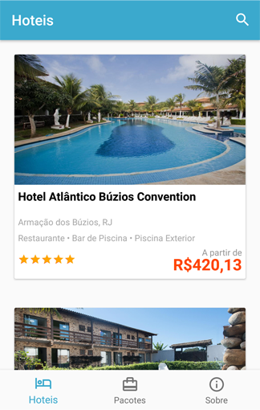
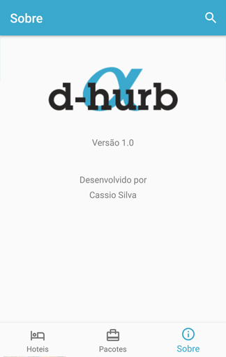
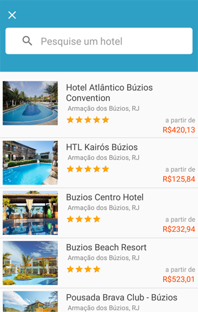

# Desafio Alpha Hurb

A instalação da aplicação é feita através do Android Android Studio, basta somente conectar o cabo USB no PC, e executar o Build.

A aplicação contém 5 Telas:

# Tela principal com a lista dos Hotéis
Apresenta informações dos hotéis, como por exemplo, nome, preço, a foto, as comodidades e a quantidade de estrelas.
Essas informações são apresentadas de acordo com a quantidade de estrelas, na ordem decrescente.

  

# Tela com os Detalhes dos Hotéis
Além das informações da tela anterior, nessa tela apresenta descrição do hotel.

  

# Tela com Informações do Aplicativo
Versão do aplicativo e nome do desenvolvedor da aplicação

  

# Tela com os Pacotes
Informações do Pacote de viagens:

- Nome do Pacote
- Cidade e Estado
- Preço

  

Obs.: A API https://www.hurb.com/search/api?q=buzios&page=1, na maioria das vezes não retorna as informações do pacote, quando isso acontece, a aplicação exibe uma mensagem para acessar essa tela mais tarde.

# Tela com busca aos Hotéis
Apresenta nome, preço, a foto, as comodidades e a quantidade de estrelas dos hotéis, e contém um campo para fazer a busca pelo nome do hotel.

  

# Testes

Os testes foram executados eliminando erros como por exemplo o carregamento da API. Se algum dado da API for vazio, eliminamos o valor nulo, e a listagem continua.

Se a API retornar vazia a aplicação é carregada sem valores, evitando falha na execução do aplicativo.

Se o dispositivo estiver sem conexão à internet, é exibido uma tela dizendo que está com falta de conexão, evitando que o aplicativo falhe e feche.
