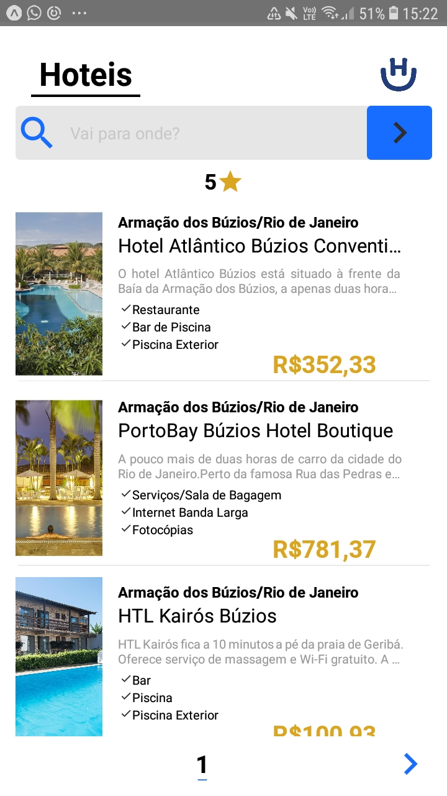

#  Desafio Alpha

## funcionalidade
 
A Aplicação foi desenvolvida em React native e tem o intuito de listar um JSON exposto pela API(dada pelo desafio),  
além de agrupar os hoteis e pacotes em sessões separadas por títulos.

Os Hoteis são agrupados pela quantidade de estrelas em ordem decrescente e contam
informações como preço, descrição, localização e etc.

OBS: Foram desenvolvidas algumas funcionalidades a mais como:
-busca da api de qualquer localidade.
-paginação da lista.
-Botão de ajuda integrado ao Whatsapp ou E-mail.
-Pagina mais detalhada do hotel.
-Suporte e detectação da preferencia de temas do usuário(DarkTheme, LighTheme).
-Cada "Card" é clicavel, levando a uma pagina com mais detalhes.

 
## Tecnologias utilizadas

- [ReactNative](https://reactnative.dev/)
- [Axios](https://github.com/axios/axios#axios)
- [styled-components](https://styled-components.com/)
- [expo](https://expo.io/)

## Decisões técnicas

Tentei seguir fielmente o 'layout' proposto pelo desafio, por isso como podem ver
existem titulos separando as celulas de hoteis por estrelas. porém acho que ficaria melhor
se fosse implementado um filtro para o usuário escolher a quantidade de estrelas que deseja buscar
e com isso implementar também uma 'lista inifinita'.

## Contato

- LinkedIn: [@Miltonvilarinonetto](https://www.linkedin.com/miltonvilarinonetto/)
- GitHub: [@Miltonvilarino](https://github.com/Miltonvilarino)
- Instagram :[@Miltonvilarino](https:/
