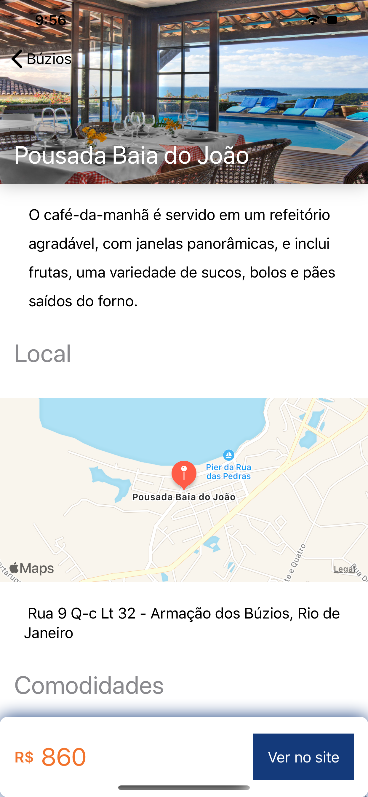
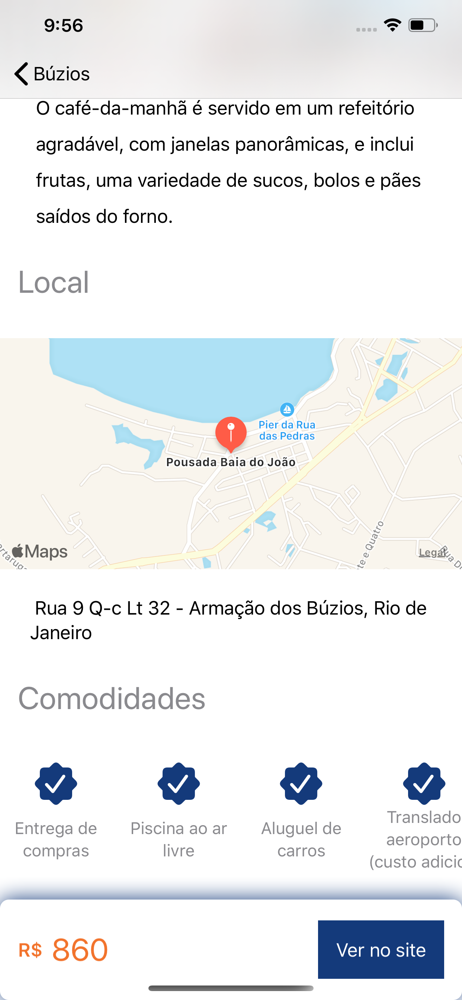

# Challenge-alpha

## 1. Conteúdo

-   [1. Conteúdo](#1-conteúdo)
-   [2. O Projeto](#2-o-projeto)
-   [3. Design](#3-design)
-   [4. Testes](#4-testes)
    -   [4.1. Unitários](#41-unitários)
-   [5. Dependências](#5-dependências)
    -   [5.1. CocoaPods](#51-cocoapods)
        -   [5.1.1. SwiftLint](#511-swiftlint)
        -   [5.1.2. Moya](#512-moya)
        -   [5.1.4. Kingfisher](#514-kingfisher)
-   [6. Vulnerabilidades](#6-vulnerabilidades)
    -   [6.1. Falta do protocolo HTTPS](#61-Falta-do-protocolo-HTTPS)

## 2. O Projeto

Arquitetura: **MVVM**

O Projeto foi desenvolvido utilizando o framework SwiftUI que possibilita o desenvolvimento de interfaces de maneira declarativa além de oferecer suporte a visualização do layot em tempo real. O SwiftUI ofeece suporte nativo para implementação do paradigma da programação reativa.

A arquitetura adotada foi o MVVM pois proporciona um baixo acoplamento e favorece a execução de testes. Sua caracteristica principal é a separação de toda regra de negócio da camada de exibição.

Para consulta dos hoteis e pacotes foi utilizadado o end-point `GET https://www.hurb.com/search/api?q=buzios&page=PAGE` onde o parametro PAGE é um número aleatório entre 1 e 17. Isso possibilita a execução de todos os cenários possíveis de acordo com o retorno de dados da API.

A Aplicação é composta de uma listagem de hoteis e pacotes. Eles são atrupados entre a classificação das estrelas e os pacotes, que são exibidos de maneira separada. Há uma rolagem horizontal dentro das categorias possibitilando selecionar os hoteis e pacotes. É possivel selecionar um hotel ou pacote e exibir mais detalhes sobre a acomodação como endereço, preço, mapa do local, comodidades além da abertura da página do site do HURB.

## 3. Design

Desing simplista utilizando os guidelines e componentes da Apple com a palheta de cores do HURB

    
    
    

## 4. Testes

### 4.1. Unitários

Foram implementados testes em todas as requisições de rede além das propriedades presentes em todos os ViewModels, garantindo assim a integridade da aplicação.

## 5. Dependências

### 5.1. CocoaPods

#### 5.1.1. [SwiftLint](https://github.com/realm/SwiftLint)

O Projeto foi desenvolvido utilizando o SwiftLint que garante a padronização do código, sendo utilizando em times de desenvolvimento.

#### 5.1.2. [Moya](https://github.com/Moya/Moya)

As requisiçoes foram implemtadas utilizando o Moya pois o mesmo oferece uma grande abstração das requisições, inspirada no conceito de encapsular solicitações de rede de maneira segura, tipicamente usando enumerações, que fornece confiança ao trabalhar com a camada de rede. o Moya tem como um grande benefício a facilidade de executar testes nas requisições.

#### 5.1.3. [Kingfisher](https://github.com/onevcat/Kingfisher)

Ferramanta que auxilia o carregamentpo imagens de maneira assíncrona e implementa recussos de cache.

## 6. Vulnerabilidades

### 6.1. Falta do protocolo HTTPS

Em decorrência da não utilização do protocolo https em algumas imagens foi necessário a liberação do domínio http://media.omnibees.com para execução das requisições sem o protocolo de segurança.
