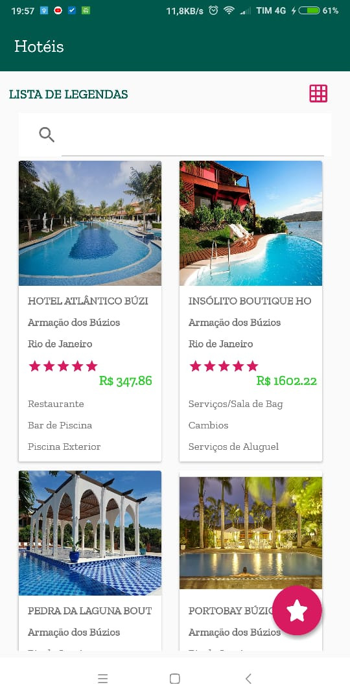
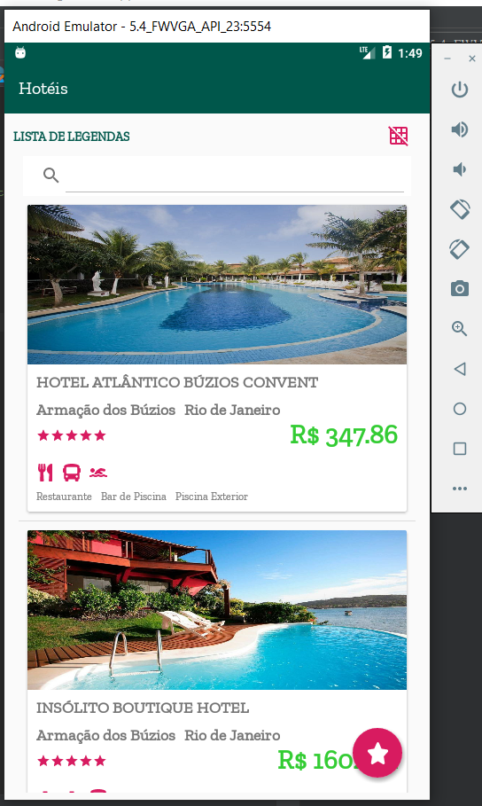
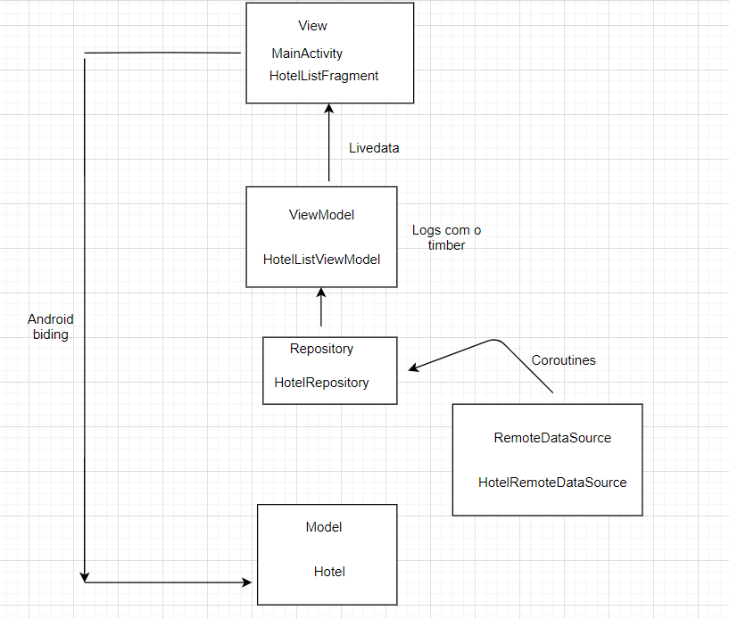
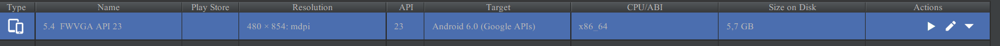

 Desafio Alpha

*Tecnologias utilizadas*: 

Kotlin - como linguagem de programação;
Retrofit - para requisições HTTP;
Koin - para injeção de dependência;
Coroutines - chamadas assíncronas ao servidor;
MVVM - arquitetura do projeto;
Livedata - atualizações dos dados que são enviados para View;
Android Binding - para realizar o binding dos dados da view com o modelo
Timber - para gerenciamento de Logs
Junit - para testes unitários
Hamcrest como estrutura de asserção
Roboletric
Espresso
Mockito

## Requisitos Mínimos

Foi implementado o consumo ao endpoint obrigatório:
`GET https://www.hurb.com/search/api?q=buzios&page=1` 
Foram realizadas chamadas assíncronas utilizando coroutines e emitidos os logs dos dados recebidos com o Timber. Os resultados foram lidos e salvos em uma lista da entidade Hotel.
Os dados são apresentados em dois tipos de Layout: uma lista de CardView (padrão, quando o aplicativo é aberto) e caso seja clicado no botão no canto superior direito,  é exibido os resultados da pesquisa em um GridLayout. 
Os dados exibidos são os requisitados como obrigatórios: Nome do hotel, preço, cidade, estado, uma foto e três amenidades. 
Acrescentei três ícones de legenda que são responsáveis por mostrar a categoria das três amenidades (no canto superior esquerdo existe um textview que ao ser clicado, ele mostra o que significa cada legenda).
Os hotéis são listados de maneira decrescente pelo número de estrelas. E podem ser filtrados pela quantidade de estrelas também (ao clicar no botão de estrelas no canto inferior direito é aberto uma lista de quantidade de estrelas).

  
  
  
  

Não achei necessário realizar persistência de dados no banco local, uma vez que a aplicação deve funcionar somente online, já que é um app de pesquisa de hotels e preços. 
Mas caso tivesse implementado algo, o repository se comunicaria com o Remote data source e persistiria no banco local os dados que ainda não estavam presentes no 
Local Data source (classe que não foi implementada), eu utilizaria o ROOM para fazer isso. A camada repository seria a responsável pro fazer esse gerenciamento, então manteria correto o desacoplamento e a manutenção do app. 
Abaixo tem um modelo da arquitetura:

  

Obs: Faltou implementar o Layout de grid para todos os tamanhos de tela, as configurações de tela e emulador que utilizei
estão abaixo.

  

Creio que no geral o layout ficou bom e intuitivo.

  

