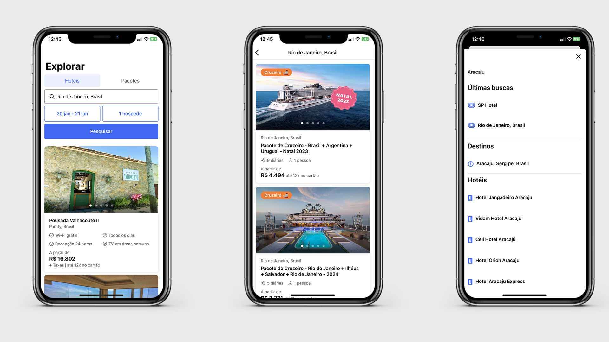
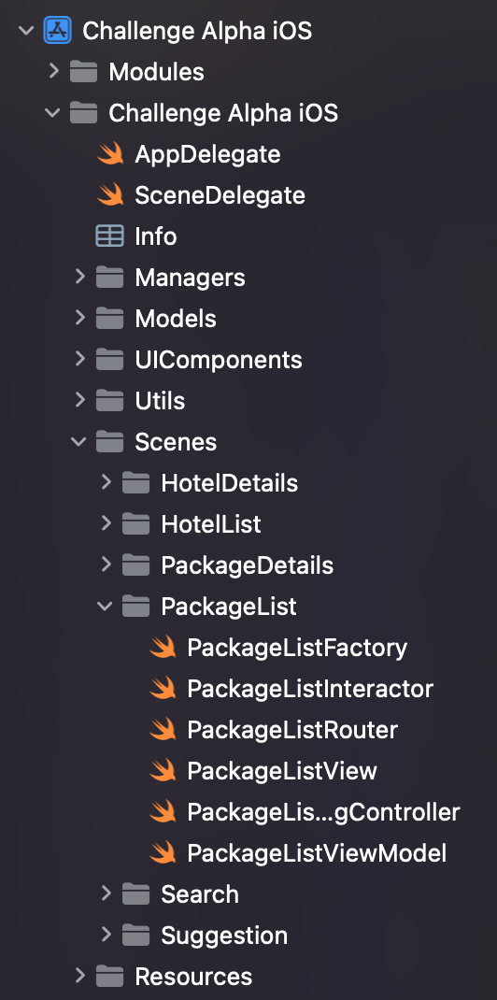

# Hurb Challenge Alpha

O desafio consiste em criar aplicativo para dispositivo móvel (Swift) que consuma o JSON exposto pela nossa API GraphQL de busca e apresente as informações em uma listagem. Você é livre para utilizar bibliotecas de terceiros.

## Interface

## Features

- [x] Busca por Hotel
    - Com personalização da query string, data de entrada e saida, número de hóspedes.
- [x] Busca por Pacote
- [x] Lista dos resultados da API Search
- [x] Lista dos resultados da API Package
- [x] Lista dos resultados da API Hotel
- [x] Tela de loading
- [x] Tela de error
- [x] Sugestões de busca
    - Com buscas recentes. 
- [x] Tela de detalhes do Pacote
- [x] Tela de detalhes do Hotel
- [x] Compartilhamento de Hotéis e Pacates
- [x] Logs
- [x] Testes

## Estrutura do projeto e Arquitetura
O projeto foi desenvolvido na arquitetura MVVM e adotando alguns Design Patterns para melhorar a estrutura do projeto.  
"Camadas" do projeto:
- Network: Utilizei o HUNetwork disponibizado por vocês para fazer as chamadas a API GraphQL. Ele esta localizado em Modules/HUNetwork.
- Models: Entidades usadas na aplicação (SearchResult, HotelResult, PackageResult).
- Managers: Singletons de responsabilidade única usados no projeto. Só foi necessário criar um Manager para o controle dos dados de buscas recentes armazenados localmente (UserDefaultsManager).
- Utils: Todo arquivo com classes e funções que facilitam o desenvolvimento do projeto (Extensions, Constants, etc.).
- Resources: Assets e LaunchScreen.
- UIComponents: Encapsula todos os componentes visuais menores (não telas inteiras) do App. É um diretório com arquivos que utilizam apenas a biblioteca visual escolhida (SwiftUI), ou seja, não tem dependências externas.
- Scenes: Interface do usuário, usando MVVM. Essa camada cria todas as telas do App de maneira modularizada. Cada cena possui os seguintes arquivos:
    - Factory: Instancia todas os objetos da cena e injeta neles suas dependências.
    - Interactor: Responsável pelo resgate dos dados da API necessários para a cena e envio para o ViewModel.
    - Router: Responsável por todo o processo de navegação da cena.
    - ViewModel: Responsável por toda a lógica da cena.
    - View: Intreface visual feita em SwiftUI.
    - HostingController: Encapsula a View feita em SwiftUI para ser utilizada no contexto do UIKit.

  

## Como rodar?
1. Clonar o repositório ou fazer download do arquivo zip.
2. Abrir o arquivo `Challenge Alpha iOS.xcodeproj` com o Xcode.
3. Rodar o projeto no Xcode.

## Requisitos
- iOS 14+
- Swift 5
- SwiftUI 2.0
- Xcode 14.2

## Dependências

- [**Kingfisher**](https://github.com/onevcat/Kingfisher): Biblioteca responsável pelo download, cache e exibição de imagens da Web (URL). A motivação para o uso foi devido a facilidade e o bom funcionanmento da biblioteca para mostrar as imagens recebidas da API, evitando ter que fazer esse processo "na mão" do zero.
- **HUNetwork**: Biblioteca responsável pelas chamadas a API GraphQL da Hurb.

O gerenciador de dependência escolhido foi o `Swift Package Manager`

## Comentários
De inicio, agradeço pela oportunidade de participar do desafio. No período de 10 dias, busquei colocar no projeto a maior parte dos meus conhecimentos adquiridos durante os anos de desenvolvimento iOS.

Me engajei bastante na jornada de criação do projeto, utilizei o mesmo para estudar novas tecnologias (GraphQL) e aprofundar em alguns Design Patterns. Estava a um tempo sem iniciar um projeto novo no Xcode e acho que por isso acabei me empolgando um pouco 😅.

Quero aproveitar o campo de comentários para falar sobre algumas decisões adotadas no projeto.
1. Escolhi fazer o projeto em um ambiente misto entre UIKit e SwiftUI por alguns motivos. O primeiro deles é devido algumas limitações ainda existentes no SwiftUI, principalmente relacionado a liberadade de navegação entre telas e customização da UINavigationBar. O segundo é devido a adoção de SwiftUI nos Apps de mercado. Por ser uma tecnologia recente, os aplicativos ainda estão se modernizando e ambientes mistos entre UIKit e SwifUI é uma realidade.
2. O deployment target do projeto escolhido foi o 14.0, apesar de ser pedido 13.0 ou menor. O motivo por essa escolhe foi para facilitar o desenvolvimento, visto o tempo que tinha para fazer. Alguns componentes visuais importantes em SwiftUI (TabView com paginação e KFImage) precisavam do targe 14.0 ou superior, fazer-los em UIKit e coloca-los em SwiftUI demandaria um tempo que pode ser utilizado em outras funcionalidades do projeto.
3. Dei muita enfase a parte visual do projeto, pois gosto bastante da área de UI do iOS e busquei dar meu máximo no limite de 10 dias. Por isso alguns dos requisitos diferenciais, como os vistos por último e favoritar oferta (apesar de serem extras) não foram implementados. Apesar de ter total capacidade para isso, mas não tive o tempo.
4. Testes unitários foram implementados somente para os arquivos relacionados a cena de Package (Interactor e ViewModel). Os mesmos testes poderiam ser feitos para as demais cenas.

Mais uma vez, obrigado pela oportunidade e qualquer dúvida estou aberto para contato.
